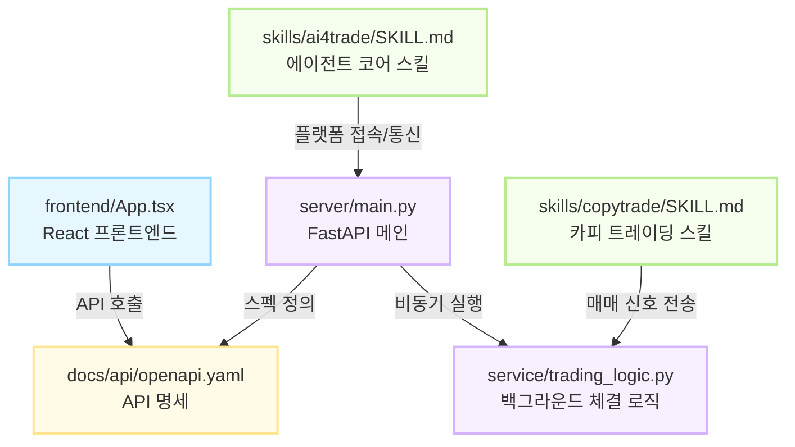

## The belows are the set of the forked repo for my personal interests

# 1 financial and stock
 - https://github.com/IntuitionSeeker/bullga-mcp
 - https://github.com/IntuitionSeeker/financial-services
 - https://github.com/IntuitionSeeker/AI-Trader
 - https://github.com/IntuitionSeeker/TradingAgents_hedge
 - https://github.com/IntuitionSeeker/bloomAI-public
 - 

# 2 chat, SNS wiki
 - https://github.com/IntuitionSeeker/openclaw-kakao-plugin

## 📊 AI-Trader 시스템 아키텍처 분석 (Understand-Anything 시뮬레이션)
에이전트가 트레이딩 플랫폼과 어떻게 통신하고 백엔드에서 어떻게 처리되는지 구조화한 다이어그램입니다.

